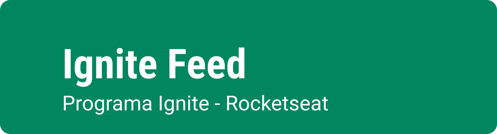
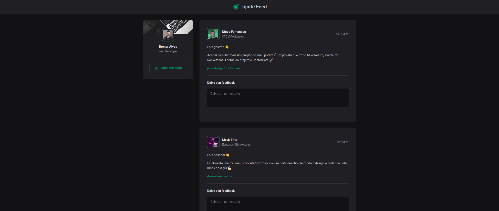
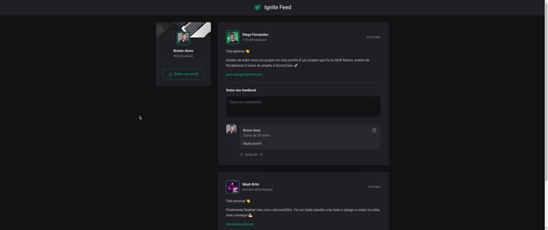

<div align="center" >
  
</div>
<br>

<div align="center" >
  
</div>
<br>

## 💻 Demo
<div align="center" >
  
</div>

## 🛠 Tecnologias

Esse projeto foi desenvolvido com as seguintes tecnologias:
- HTML
- CSS
- Typescript
- React
- Vite

## 📜 Projeto

Ignite Feed é uma aplicação React utilizando o Vite, que foi desenvolvida no curso Ignite da Rocketseat. Tem como objetivo aprender sobre os fundamentos do ReactJS, utilizando conceitos como componentização, propriedades, estados, imutabilidade e hooks.

### 📚 Pré-requisitos

Antes de começar, você vai precisar ter instalado em sua máquina as seguintes ferramentas:
[Git](https://git-scm.com), [Node.js](https://nodejs.org/en/).
Além disto é bom ter um editor para trabalhar com o código como [VSCode](https://code.visualstudio.com/)

### ⚙️ Rodando o Web

```bash
# Clone este repositório
$ git clone https://github.com/Brenerr/01-fundamentos-reactjs-ts

# Acesse a pasta do projeto no terminal/cmd
$ cd 01-fundamentos-reactjs-ts

# Instale as dependências
$ npm install

# Execute a aplicação em modo de desenvolvimento
$ npm run dev
